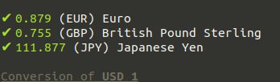
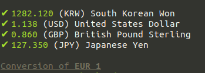

# Cash

## Small node module **displaying currency conversions** using the **latest** api from *exchangeratesapi.io*

---

### 1. How to use

**1. Prerequisites**

First, make sure you have installed **node** and **npm** on your computer :

* With Ubuntu, open Terminal and type :

`sudo apt install nodejs -y`

`sudo apt install npm -y`

* With Windows or Mac, search for a tutorial online

**2. Clone repository**

* Now clone this github repository :

`cd /path/to/workspace/`

`git clone git@github.com:Im2Slow/3-musketeers.git`

**OR**

* Fork this github repository and copy git file to clipboard, then :

`git clone git@github.com:YOUR_GITHUB_ACCOUNT/3-musketeers.git`

**3. Setup & run**

* Go to your local repository :

`cd /path/to/workspace/3-musketeers/cash/bin`

* Run `npm i` and `node bin/index.js`

**4. Display**



---

### 2. Use your currencies

* Run with the currency acronyms you want :

*Example :*

```sh
node bin/index.js --set eur krw usd gbp jpy
```

*Output :*



**Notes** :

* The first argument after `--set` is the converted unit : here **1 EUR**.

* You can list as much currencies as you want

* To find new currencies, check this link : https://www.ecb.europa.eu/stats/policy_and_exchange_rates/euro_reference_exchange_rates/html/index.en.html

* For more information on the api usage, ask https://exchangeratesapi.io/
